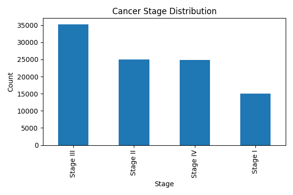
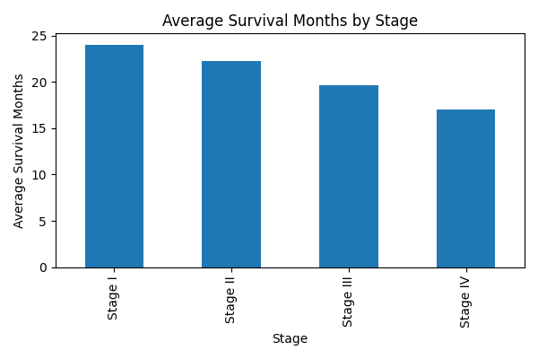
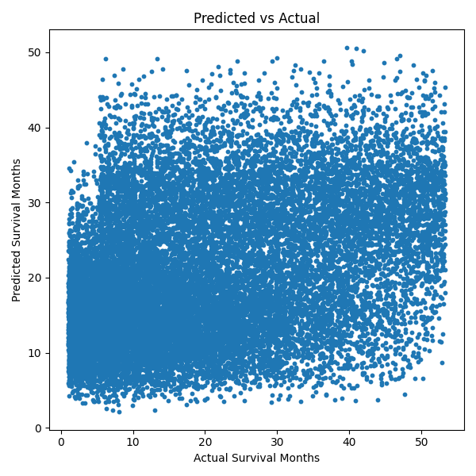

# 🧬 Indian Cancer Survival Analysis & Prediction

## 📌 Overview

This project demonstrates an end-to-end data science workflow using Python and Machine Learning. It explores an Indian cancer patient dataset, performs exploratory data analysis (EDA), creates visualizations, and builds a Random Forest Regression model to predict patient survival months.

## 🎯 Key Features

- Data preprocessing and cleaning
- Exploratory Data Analysis (EDA)
- Data visualizations using Matplotlib
- Machine Learning with Random Forest Regression
- Survival month prediction
- Model evaluation using Mean Absolute Error (MAE)

## 📂 Dataset

**Dataset:** India Cancer Patient Dataset (2022–2025)

**Source:** Kaggle  
https://www.kaggle.com/datasets/ashyou09/india-cancer-patient-dataset-2022-2025

> **Note:** The dataset is not included in this repository. Download it from Kaggle and place it in the project folder before running the code.

## 📊 Visualizations

### Cancer Stage Distribution


### Average Survival Months by Stage


### Predicted vs Actual Survival Months


## 🤖 Machine Learning

- **Model:** Random Forest Regressor
- **Target:** `Survival_Months`
- **Evaluation Metric:** Mean Absolute Error (MAE)
- **Observed MAE:** Approximately **11.21 months**

The model estimates survival months based on patient characteristics available in the dataset.

## 🔍 Key Insights

From this project, the following insights can be explored from the dataset:

- Distribution of patients across different genders.
- Most common cancer types represented in the dataset.
- Distribution of patients across cancer stages.
- Average recorded survival months for different cancer stages.
- Patterns between demographic and clinical features and survival months.
- Machine learning predictions of survival months based on available patient information.
- Comparison between actual and predicted survival values to evaluate model performance.

> These insights are based on the provided dataset and are intended for educational and analytical purposes only. They should not be interpreted as medical conclusions or clinical recommendations.

## 🛠️ Technologies Used

- Python
- Pandas
- Matplotlib
- Scikit-learn
- Joblib

## ▶️ How to Run

1. Download the dataset from Kaggle.
2. Install the required packages:
   ```bash
   pip install pandas matplotlib scikit-learn joblib
